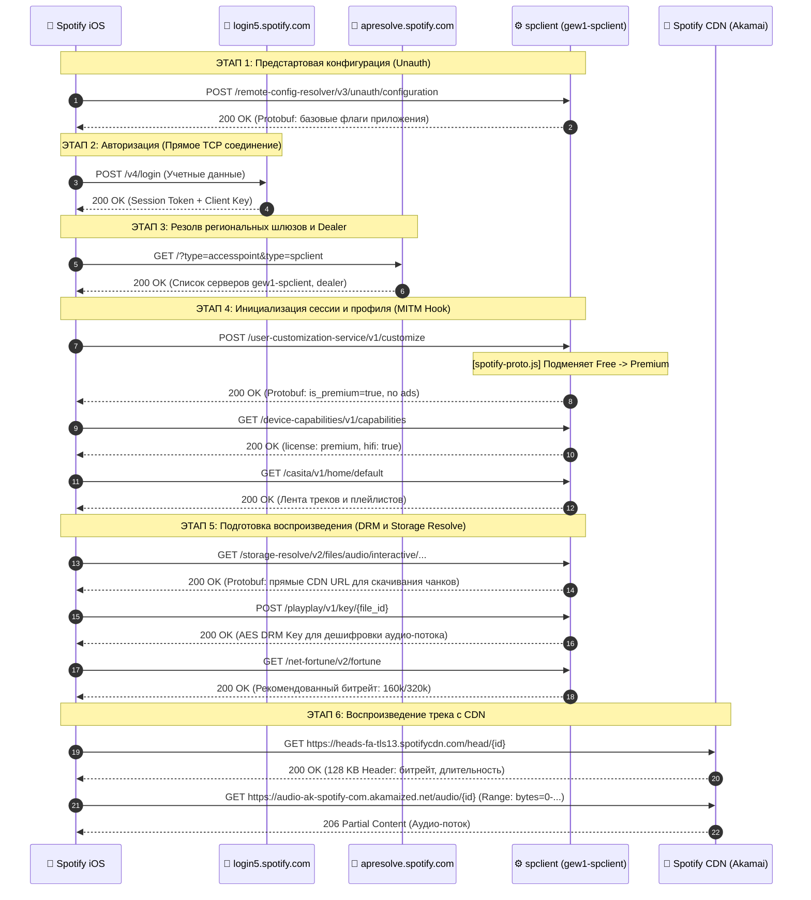

# 🌲 Дерево сетевых запросов и архитектура API Spotify (iOS)

На основе анализа живых сетевых дампов и реверс-инжиниринга трафика приложения **Spotify iOS (9.1.78)**.

---

## 🏛 1. Карта доменов и хостов Spotify

```text
Spotify Network Ecosystem
├── 🔐 Авторизация и Токены (NO MITM - SSL Pinning)
│   ├── login5.spotify.com                  # OAuth2 / Auth exchange (/v3/login, /v4/login)
│   ├── apresolve.spotify.com               # Дискавери ближайших серверов точек доступа (AccessPoints)
│   └── gew1-dealer.g2.spotify.com          # WebSocket / Long-polling (Push-уведомления, статус плеера)
│
├── ⚙️ Управление сессией и API (MITM)
│   ├── spclient.wg.spotify.com             # Глобальный API шлюз
│   │   ├── /remote-config-resolver/v3/unauth/configuration # 🎯 Стартовая удаленная конфигурация клиента
│   │   ├── /reachability/check             # Проверка доступности сети (HEAD)
│   │   └── /identity/v3/user/username/...  # Профиль пользователя и аватар
│   └── *-spclient.spotify.com              # Региональные кластеры API (напр. gew1-spclient, guc3-spclient)
│       ├── /user-customization-service/v1/customize   # 🎯 Подписка, флаги Premium, лицензии
│       ├── /bootstrap/v1/bootstrap                    # 🎯 Стартовая конфигурация профиля
│       ├── /device-capabilities/v1/capabilities       # Разрешения устройства (HiFi, playback speed)
│       ├── /pushka-tokens/register/v3                 # 🔔 Регистрация Push-токенов клиента
│       ├── /storage-resolve/v2/files/audio/...        # 🎵 Резолв URL аудио-файлов и prefetch чанков
│       ├── /playplay/v1/key/{file_id}                 # 🔐 Получение DRM-ключа расшифровки аудио
│       ├── /net-fortune/v2/fortune                    # 📈 Измерение скорости сети и адаптивный битрейт
│       ├── /pam-view-service/v1/GetPremiumPlanRow     # 💳 Отображение тарифа и цен Premium в профиле
│       ├── /pam-view-service/.../GetPlanOverview      # 💳 Обзор доступных планов подписки
│       ├── /premium-destination-hubs/v2/page          # 💎 Вкладка "Премиум" (Hub-страница тарифов)
│       ├── /sessiontransfer/v1/token                  # 🔄 Передача токена сессии (Web / Connect Handover)
│       ├── /capping-api/.../PutConsumption            # ⚠️ Лимиты и счетчики пропусков треков на Free
│       ├── /social-connect/v2/sessions/current        # 🤝 Spotify Jam (совместное прослушивание)
│       ├── /social-connect/v2/devices/.../jam_status  # 🤝 Статус Jam сессии
│       ├── /speechless/v1/retrieve/chats-share-set/.. # 💬 Внутренний мессенджер/шеринг треков
│       ├── /speechless-sharing/v1/retrieve/nudge-data # 💬 Данные подсказок шеринга (Nudge Data)
│       ├── /connect-state/v1/devices/...              # Spotify Connect (управление устройствами)
│       ├── /connect-group/v1/refresh-group-data       # Синхронизация группы устройств Connect
│       ├── /herodotus/spotify.resumption.v1/...       # Синхронизация точки воспроизведения трека (Resume)
│       ├── /playback-settings/.../PlaybackSettings... # Настройки воспроизведения (Crossfade, EQ, качество)
│       ├── /scrollsita/v1/scroll/spotify:track:...    # 📱 Бесконечная лента рекомендаций под треком
│       ├── /inspiredby-mix/v2/seed_to_playlist/...    # 📻 Генерация миксов по треку (Радио по треку)
│       ├── /color-lyrics/v2/track/...                 # Тексты песен (Lyrics)
│       ├── /casita/v1/home/default                    # Главная страница (лента рекомендаций)
│       ├── /casita/v1/feeds                           # Вкладки ленты рекомендаций ("Музыка", "Подкасты")
│       ├── /browsita/v1/browse                        # Вкладка "Поиск" и жанры
│       ├── /playlist/v2/... & /playlist-permission/...# Синхронизация плейлистов и очередей
│       ├── /contribution/v1/contributions/BatchGet... # Авторы, продюсеры и контрибьюторы трека
│       ├── /gander/v2/GetUserHasUnreadNotification    # 🔔 Проверка непрочитанных уведомлений
│       ├── /user-profile-view/v3/profile/...          # Профиль пользователя, топ артистов и плейлистов
│       ├── /profile-privacy/v2/read-settings          # Приватность профиля (прослушивание, подписчики)
│       ├── /notifs-preferences/v8/preferences         # Настройки уведомлений пользователя
│       ├── /account-switching-service/v1/...          # Мульти-аккаунт переключатель профилей
│       ├── /cultural-moments-entrypoints/v1/...       # Интерактивные карточки событий и концертов
│       ├── /merch-npv-service/v1/merch/track/...      # Мерч артистов под текущим треком
│       ├── /image-resolve/v1/resolve/map              # Резолв хешей картинок в прямые URL CDN
│       ├── /extended-metadata/v0/extended-metadata    # Метаданные треков/альбомов (высокая частота)
│       ├── /collection/v2/delta                       # Дельта-обновления медиатеки пользователя
│       └── /offline/v1/devices/.../resources:delta    # Оффлайн кэш и синхронизация скачанных треков
│
├── 🎵 Аудио-потоки и воспроизведение (NO MITM - High Throughput)
│   ├── heads-fa-tls13.spotifycdn.com       # Аудио-заголовки треков (первые 128 КБ, кодеки/битрейт)
│   ├── audio-ak-spotify-com.akamaized.net  # Основные чанки аудио (Akamai CDN)
│   ├── audio-fa.scdn.co                    # Альтернативные аудио CDN
│   └── *.spotifycdn.net / *.spotifycdn.com # Контентные хранилища чанков
│
├── 🖼 Медиа-ресурсы (NO MITM)
│   ├── image-cdn-fa.spotifycdn.com         # Обложки треков/альбомов (WebP/JPEG)
│   ├── seed-mix-image.spotifycdn.com       # Сгенерированные миксы (Daily Mix, Discover)
│   ├── daylist.spotifycdn.com              # Обложки и фоны плейлистов Daylist
│   ├── pickasso.spotifycdn.com             # Сгенерированные миксы и аватары
│   ├── misc.scdn.co                        # Вспомогательные статические ассеты (иконки, шрифты)
│   └── canvaz.scdn.co                      # Canvas-видео зацикленные на фоне трека (MP4)
│
└── 📊 Реклама, Телеметрия и Логи (BLOCK / REJECT)
    ├── /ad-logic/state/config              # Логика и тайминги рекламных вставок
    ├── /ads/v2/config & /ads/v3/ads        # Загрузка баннеров и аудио-рекламы (preroll/midroll)
    ├── /sponsoredplaylist/v1/sponsored     # Спонсорские плейлисты и партнерские врезки
    ├── /podcast-ap4p/leavebehinds/ads      # Реклама внутри подкастов
    ├── /trials-facade/start-trial          # Баннеры платных предложений
    ├── /vanilla/.../recommendations-in-free-tier-playlist # Блоки рекомендаций Free-тира
    ├── /partner-userid/encrypted/...       # Передача ID сторонним трекерам (Branch, OneTrust)
    ├── /partner-client-integrations/v1/... # Партнерские интеграции и категории трекеров
    ├── /gabo-receiver-service/.../events   # Телеметрия и аналитика кликов
    ├── crashdump.spotify.com               # Краш-репорты
    ├── log.spotify.com                     # Системные логи клиента
    └── census-app-x.scorecardresearch.com  # Внешний трекер ScorecardResearch
```

---

## 🔄 2. Жизненный цикл сессии (Порядок вызовов)



---

## 🎯 3. Критические точки для разблокировки Premium

| Эндпоинт / Домен | Метод | Формат | Назначение / Что нужно сделать модулю |
| :--- | :--- | :--- | :--- |
| `/user-customization-service/v1/customize` | `POST` | Protobuf | Удалить `If-None-Match`, подменить структуру аккаунта на `type: "premium"` |
| `/bootstrap/v1/bootstrap` | `GET/POST` | Protobuf | Подменить статус подписки в сессии (`streaming_rules`, `can_stream: true`) |
| `/device-capabilities/v1/capabilities` | `GET` | JSON/Protobuf | Флаги устройства (`license: premium`, `hifi: true`) |
| `/storage-resolve/v2/files/audio/...` | `GET` | Protobuf | Резолв URL чанков трека (высокое качество битрейта) |
| `/playplay/v1/key/{file_id}` | `POST` | Binary | Получение DRM-ключа для дешифровки звука |
| `/artistview/v1/artist` & `/album-entity-view/v2/album` | `GET` | URL | Заменить `platform=iphone` -> `platform=ipad` (выбор любого трека без Shuffle) |
| `*-spclient.spotify.com:443` | `ALL` | URL | Срезать порт `:443` из URL (защита от `400 Bad Request`) |
| `/ad-logic`, `/ads`, `/podcast-ap4p/.../ads` | `ALL` | - | `REJECT` (Блокировка аудио-рекламы и баннеров) |
| `/capping-api/.../PutConsumption` | `POST` | gRPC | `REJECT` / Игнорирование счетчиков лимитов на Free |
| `crashdump.*`, `log.*`, `scorecardresearch.*` | `ALL` | - | `REJECT` (Блокировка аналитики и телеметрии) |
| `login5.spotify.com`, `apresolve.spotify.com` | `ALL` | - | **Исключить из MITM** (SSL Pinning, прямой `DIRECT`) |
| `*.spotifycdn.com`, `*.spotifycdn.net`, `*.scdn.co` | `ALL` | - | **Исключить из MITM** (прямой `DIRECT` для максимальной скорости звука) |

---

## 🧬 4. Детальное сравнение Protobuf: Модификация `accountAttributes` (`spotify-proto.js`)

Модуль перехватывает ответы эндпоинтов `POST /bootstrap/v1/bootstrap` и `POST /user-customization-service/v1/customize`, извлекая и модифицируя структуру словаря `accountAttributes: map<string, AccountAttribute>`.

### Схема вложенности Protobuf:
```text
BootstrapResponse
 └── ucsResponseV0
      └── success (UcsResponseWrapperSuccess)
           └── customization (UcsResponseWrapper)
                └── success (UcsResponse)
                     └── accountAttributesSuccess (AccountAttributesResponse)
                          └── accountAttributes: map<string, AccountAttribute>

UcsResponseWrapper (для /user-customization-service/v1/customize)
 └── success (UcsResponse)
      └── accountAttributesSuccess (AccountAttributesResponse)
           └── accountAttributes: map<string, AccountAttribute>
```

### Таблица подменяемых полей и их влияние на клиент:

| Атрибут (`accountAttributes`) | Значение Free (от сервера) | Значение в скрипте (`spotify-proto.js`) | Эффект в приложении Spotify iOS |
| :--- | :--- | :--- | :--- |
| **`type`** | `"free"` | `{stringValue: 'premium'}` | **Главный переключатель**: переводит клиент в режим Premium. |
| **`catalogue`** | `"free"` / `"dayone"` | `{stringValue: 'premium'}` | Открывает доступ ко всему каталогу треков без ограничений Free. |
| **`player-license`** | `"free"` | `{stringValue: 'premium'}` | Разрешает плееру стриминг без ограничений и очередей. |
| **`name`** | `"Spotify Free"` | `{stringValue: 'Spotify Premium'}` | Отображение статуса подписки в профиле и настройках. |
| **`ads`** | `true` | `{boolValue: false}` | Отключает показ баннеров и аудио-рекламы в UI. |
| **`on-demand`** | `false` | `{boolValue: true}` | **Выбор любого трека**: позволяет включать любой трек напрямую (On-Demand). |
| **`shuffle`** | `true` | `{boolValue: false}` | Отключает принудительный режим случайного воспроизведения (Shuffle-only). |
| **`pick-and-shuffle`** | `true` | `{boolValue: false}` | Убирает интерфейсные ограничения "Pick & Shuffle". |
| **`smart-shuffle`** | `"UNAVAILABLE"` | `{stringValue: 'AVAILABLE'}` | Включает умное перемешивание с рекомендациями (Smart Shuffle). |
| **`unrestricted`** | `false` | `{boolValue: true}` | Снимает лимит 6 пропусков треков в час (неограниченные скипы). |
| **`high-bitrate`** | `false` | `{boolValue: false}` | Защита от принудительного 320k (предотвращает отказ сервера в выдаче DRM-ключа). |
| **`audio-quality`** | `"0"` | `{stringValue: '0'}` | Стабильный поток высокого качества (160 kbps OGG/AAC) без 8-секундного дропа. |
| **`loudness-levels`** | `""` | `{stringValue: '1:-5.0,0.0,3.0:-2.0'}` | Включает нормализацию громкости (Quiet / Normal / Loud). |
| **`offline`** | `false` | `{boolValue: true}` | Разрешает интерфейсу отображать переключатели оффлайн-режима. |
| **`offline-backup`** | `""` | `{stringValue: 'UNRESTRICTED'}` | Доступ к оффлайн-кэшированию треков. |
| **`lyrics-offline`** | `false` | `{boolValue: true}` | Открывает доступ к просмотру текстов песен (Lyrics). |
| **`social-session`** | `false` | `{boolValue: true}` | Включает режим совместного прослушивания **Spotify Jam**. |
| **`jam-social-session`** | `""` | `{stringValue: 'EXPANDED'}` | Полный доступ к созданию и управлению Jam-сессиями (Host). |
| **`social-session-free-tier`** | `true` | `{boolValue: false}` | Отключает Free-ограничения внутри Jam-сессий. |
| **`can_use_superbird`** | `false` | `{boolValue: true}` | Поддержка интеграций Car Thing / Superbird. |
| **`mixing-tools`** | `"NONE"` | `{stringValue: 'EDIT'}` | Доступ к инструментам плавного сведения миксов (Crossfade / Transitions). |
| **`subscription-enddate`** | Прошедшая/пустая дата | `now + 1 месяц` (`ISO String`) | Продлевает валидность подписки, предотвращая сброс сессии. |
| **`product-expiry`** | Прошедшая/пустая дата | `now + 1 месяц` (`ISO String`) | Продлевает срок действия лицензии продукта. |
| **`nft-disabled`** | `"0"` | `{stringValue: '1'}` | **NFT (Non-Free Tier)**: скрывает рекламно-покупную вкладку Premium в таб-баре. |
| **`financial-product`** | `"pr:free"` | `{stringValue: 'pr:premium,tc:0'}` | Финансовый статус продукта для внутреннего биллинга клиента. |
| **`com.spotify.madprops.use.ucs.product.state`** | `null`/`false` | `{boolValue: true}` | Указывает клиенту доверять состоянию продукта из UCS. |
| **`com.spotify.madprops.delivered.by.ucs`** | `null`/`false` | `{boolValue: true}` | Подтверждает валидность доставки флагов через UCS. |
