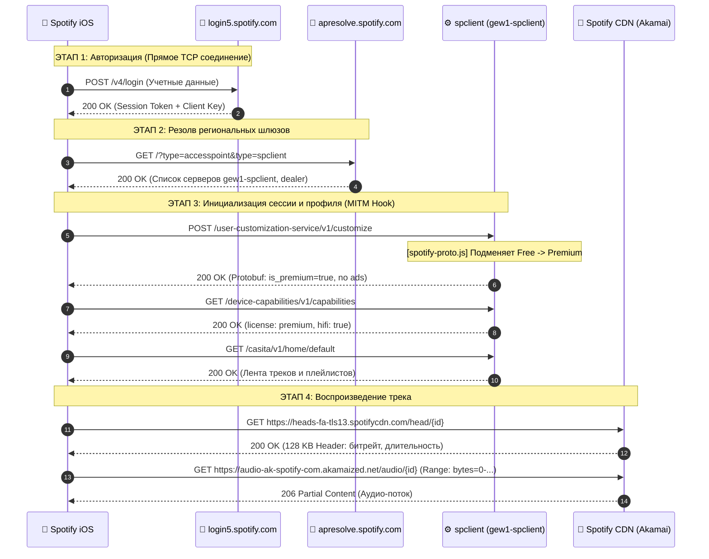

# 🌲 Дерево сетевых запросов и архитектура API Spotify (iOS)

На основе анализа живых сетевых дампов и реверс-инжиниринга трафика приложения **Spotify iOS (9.1.78)**.

---

## 🏛 1. Карта доменов и хостов Spotify

```text
Spotify Network Ecosystem
├── 🔐 Авторизация и Токены (NO MITM - SSL Pinning)
│   ├── login5.spotify.com                  # OAuth2 / Auth exchange (/v3/login, /v4/login)
│   └── apresolve.spotify.com               # Дискавери ближайших серверов точек доступа (AccessPoints)
│
├── ⚙️ Управление сессией и API (MITM REQUIRED)
│   ├── spclient.wg.spotify.com             # Глобальный API шлюз (Bootstrap, Reachability)
│   └── *-spclient.spotify.com              # Региональные кластеры API (напр. gew1-spclient, guc3-spclient)
│       ├── /user-customization-service/v1/customize   # 🎯 Подписка, флаги Premium, лицензии
│       ├── /bootstrap/v1/bootstrap                    # 🎯 Стартовая конфигурация профиля
│       ├── /pam-view-service/...                      # Бейджи тарифа ("Бесплатная версия", "Premium")
│       ├── /device-capabilities/v1/capabilities       # Разрешения устройства (HiFi, playback speed)
│       ├── /extended-metadata/v0/extended-metadata    # Метаданные треков, альбомов и артистов
│       ├── /casita/v1/home/default                    # Главная страница (лента рекомендаций)
│       ├── /browsita/v1/browse                        # Вкладка "Поиск" и жанры
│       ├── /playlist/v2/...                           # Синхронизация плейлистов и очередей
│       ├── /color-lyrics/v2/track/...                 # Тексты песен (Lyrics)
│       ├── /connect-state/v1/devices/...              # Spotify Connect (управление устройствами)
│       └── /offline/v1/devices/...                    # Оффлайн кэш и лицензии на скачивание
│
├── 🎵 Аудио-потоки и воспроизведение (NO MITM - High Throughput)
│   ├── heads-fa-tls13.spotifycdn.com       # Аудио-заголовки треков (первые 128 КБ, кодеки/битрейт)
│   ├── audio-ak-spotify-com.akamaized.net  # Основные чанки аудио (Akamai CDN)
│   ├── audio-fa.scdn.co                    # Альтернативные аудио CDN
│   └── *.spotifycdn.net / *.spotifycdn.com # Контентные хранилища чанков
│
├── 🖼 Медиа-ресурсы (NO MITM)
│   ├── image-cdn-fa.spotifycdn.com         # Обложки треков/альбомов (WebP/JPEG)
│   ├── pickasso.spotifycdn.com             # Сгенерированные миксы и аватары
│   └── canvaz.scdn.co                      # Canvas-видео зацикленные на фоне трека (MP4)
│
└── 📊 Реклама, Телеметрия и Логи (BLOCK / REJECT)
    ├── /ad-logic/state/config              # Логика и тайминги рекламных вставок
    ├── /ads/v2/config & /ads/v3/ads        # Загрузка баннеров и аудио-рекламы
    ├── /gabo-receiver-service/v3/events    # Сбор событий взаимодействия и кликов
    ├── crashdump.spotify.com               # Краш-репорты
    └── log.spotify.com                     # Системные логи клиента
```

---

## 🔄 2. Жизненный цикл сессии (Порядок вызовов)



---

## 🎯 3. Критические точки для разблокировки Premium

| Эндпоинт | Метод | Формат | Что нужно сделать модулю |
| :--- | :--- | :--- | :--- |
| `/user-customization-service/v1/customize` | `POST` | Protobuf | Удалить заголовок `If-None-Match`, подменить структуру аккаунта на `type: "premium"` |
| `/bootstrap/v1/bootstrap` | `GET/POST` | Protobuf | Подменить статус подписки в сессии (`streaming_rules`, `can_stream: true`) |
| `/artistview/v1/artist` & `/album-entity-view/v2/album` | `GET` | URL | Заменить `platform=iphone` -> `platform=ipad` (разблокировка выбора треков без Shuffle) |
| `*-spclient.spotify.com:443` | `ALL` | URL | Срезать порт `:443` из URL (защита от `400 Bad Request`) |
| `ad-logic`, `ads`, `log.spotify.com` | `ALL` | - | `REJECT` (Блокировка рекламы и логов) |
| `login5.spotify.com`, `*.spotifycdn.com` | `ALL` | - | **Исключить из MITM** (прямой `DIRECT` для надежности) |
